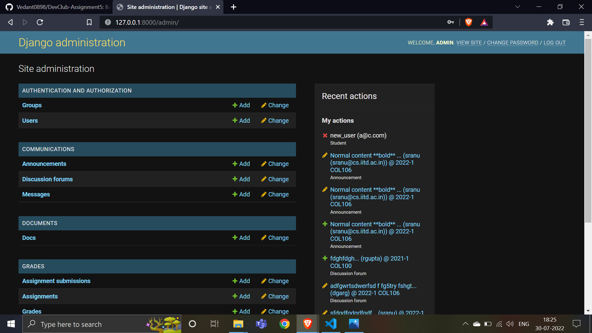
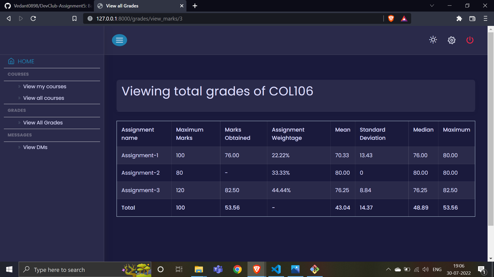

# DevClub Assignment 5

# Instructions to run this project

## Users
Users are of 3 types
- Instructor
- Student
- Admin
 

### Instructor Home Page

### Student Home Page

### Admin Home Page (Default Django admin site)

 

### Profile page

 

---

### Login

### Registration

---

### My courses

Note: Create new course is only visible for Instructor

### Course
- Instructor can edit and create new course
- Instructor View 
- Student View 

### Participants page

### Course material
- Instructor can edit, delete and add new material

---

### View all assignments
- Instructor can add/edit and create assignment

### Assignment view

Couldn't complete design of assignment section

### View submission of assignment

---

### Total Grade (instructor view)
- Stats of all assignments and total grade
- Can be calculated automatically by **Calculate Total Grades** in Course page or uploaded manually by instructor

### Total Grade of all courses (student view)
- Grades of all courses in which the student is registered

### Gradesheet of one course (student view)
- Grades of all assignments and stats of a course

---
## Additional Featurs

### Light Theme
- Option to switch to **Light Theme**

### Responsive on Mobile
- All pages are responsive on mobile with collapsible side bar

### Markdown support in communications

---
### Small issues
- Unfortunately the project couldn't be deployed on Heroku 
- Assets folder is not completely uploaded (ig it needs LFS will try it later) 
- Couldn't complete linking and designing of DMs and Discussion Forum (btw implementation complete)
- Assignments section couldn't be designed completely

---
You have learnt about backend engineering with Django in our session. Now use it to create a web application by yourself!
## DevClub LMS (Learning Management System)
You must have used **Moodle** in your courses, where both instructors and students login, and for each course, the instructor uses the platform to share resources, send announcements, release grades, conduct quizzes and what not!

Your task is to create your own such a learning management system using Django, where you can add functionalities as per your own creativity!

### We would recommend you to have these apps inside the project: 
- Users (to store auth logic, and models for `Instructor`, `Student`, `Course`, `Admin`)
- Grades (to store logic for sharing grades for any assessment, and models for let's say a class `Grade`)
- Documents (for Instructor to upload `Docs` like lecture notes for the course)
- Quizzes (this can have models for a `QuestionBank` containing `Question`'s which form a `Quiz`)
- Communication (to work on features like Course-wide `Announcements`, `Reply`ing in threads to announcements, sending personal `Messages`)

Try to implement as many features as you can, but make sure to plan the structure of the project and database schemas well!

### Bonus:
- Deploy on Heroku
- Create documentation for any RESTful APIs created with documenter on postman
- Markdown support for Communication
- Email: For registration, password reset, notifications, instructor custom message
- Bulk upload from CSV for grades, quizzes
- Generating PDF: Print digitally signed transcript
- Add security features for the quizzes

## Submission Instructions
- **FORK** this repository, by clicking the "Fork" button on top right
- `clone` the forked repo into your machine, and `cd` into the Repo Folder such that you are in same directory level as `manage.py`
- If on macOS, run `python3 -m venv env`, otherwise `python -m venv env`
- Now activate the virtual environment by `source env/bin/activate`
- See if the environment is correctly set by running `pip list`, it should be mostly empty
- Install dependencies with `pip install -r requirements.txt`
- We have already started a dummy project called `DevClubLMS` for you
- Now, you can use `python manage.py runserver` to start the dev server or `python manage.py startapp <appname>` to create a new app inside this project
- After completing the assignment, append instructions to run your project, along with explanation of features etc in this README
- It would be nice if you can host it on Heroku and also give a documentation of each endpoint through postman
- Finally submit with your details in the [Google Form](https://forms.gle/XSidrfbrsEZuDYfy6)
- You do NOT need to make any pull requests to this repo

# Resources
- [Slides used in the session](https://docs.google.com/presentation/d/e/2PACX-1vQbtDDGQonkIoGu68VrINL2s3sQcfiH5XVnk-iU26nk16DFBGsDabichsqhdtBvowPvpxaIbFLAV2h3/pub?slide=id.p)
- Introduction to Python and Django by [Programming With Mosh](https://youtu.be/_uQrJ0TkZlc)
- Detailed Django Tutorials by [Corey Schafer](https://www.youtube.com/playlist?list=PL-osiE80TeTtoQCKZ03TU5fNfx2UY6U4p)
- [Mozilla's Tutorials](https://developer.mozilla.org/en-US/docs/Learn/Server-side) on Server Side Programming with Django
- [Django Official Docs](https://www.djangoproject.com/start/)
- [Talk](https://youtu.be/lx5WQjXLlq8) on how Instagram uses Django at production, and also [*the time when Justin Beiber almost crashed Instagram!*](https://youtu.be/lx5WQjXLlq8?t=715)
- Advice on Backend Engineering by [Hussein Nasser](https://www.youtube.com/c/HusseinNasser-software-engineering)
- Guide for Deploying Python apps on [Heroku](https://devcenter.heroku.com/categories/python-support)
- Guide for [Postman Documenter](https://learning.postman.com/docs/publishing-your-api/documenting-your-api/)
